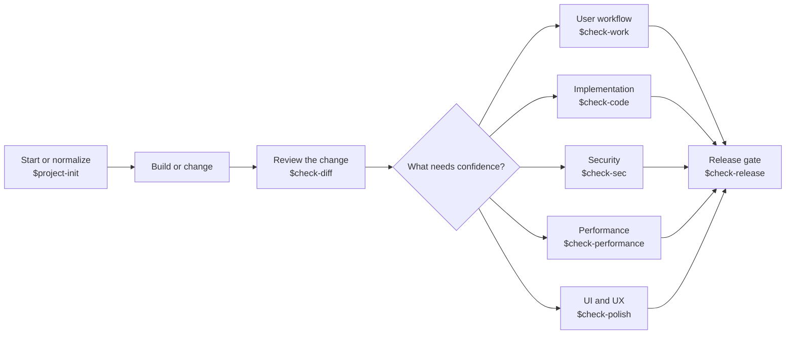

# GiftedLosers Check Skills

> Build freely. Check deliberately. Ship with evidence.


GiftedLosers Check Skills is a personal set of on-demand Codex workflows for the moments when “looks good” is not enough.

Each skill owns one question: Does the change hold up? Does the product actually work? Is the code sound? Is it secure, fast, polished, and ready to release? The answer must come from repository evidence, executed checks, or an honestly labeled verification gap—not confidence theater.

## The vision

Good software work needs two different modes:

- a **building mode** that can move quickly and make changes;
- a **checking mode** that stays independent, gathers evidence, and never quietly fixes the thing it is grading.

This suite keeps those modes separate. `$project-init` may establish or normalize a project. Every `$check-*` skill is audit-only: it reports findings and returns a ready-to-paste remediation prompt for a separate correction task.



You do not need to run every lane. Pick the check that owns the current risk.

## Choose the right skill

| Skill | Question it answers | Use it when | Changes files? |
|---|---|---|---|
| `$project-init` | Is this project structured and configured sensibly? | Starting a project or normalizing an existing repository | Yes, within the repository |
| `$check-diff` | Did this change introduce a defect or repository-hygiene problem? | Reviewing a branch, commit range, staged work, or working tree | No |
| `$check-work` | Does the feature work end to end for a real user? | Proving the stated behavior through the real product surface | No |
| `$check-code` | Is the implementation correct, reliable, and maintainable? | Auditing code paths, failure handling, data integrity, and production readiness | No |
| `$check-sec` | Is there a practical exploit or unsafe trust assumption? | Reviewing auth, secrets, input, system boundaries, dependencies, and privacy | No |
| `$check-performance` | Is there a measured performance problem? | Investigating speed, memory, startup, I/O, or responsiveness with evidence | No |
| `$check-polish` | Does the interface hold up visually and interactively? | Auditing UI, UX, accessibility, responsiveness, and platform behavior | No |
| `$check-release` | Is the repository and product ready to ship? | Checking docs, versioning, build, packaging, install, upgrade, signing, and removal | No |

### The boundaries that matter

- `$check-diff` owns what the selected change introduced. It does not become a whole-repository audit.
- `$check-work` owns user-visible behavior. `$check-code` owns whether the implementation itself is sound.
- `$check-polish` runs the interface; it is not a README or repository-style review.
- `$check-release` owns the final GO/NO-GO decision, including the public repository surface and distribution path.

## The audit contract

Every check uses the same vocabulary so results stay comparable.

### Results

| Result | Meaning |
|---|---|
| `PASS` | Primary verification ran, meaningful scope was covered, and no actionable findings remain |
| `PASS WITH RISKS` | No release-level failure was proven, but lower-severity findings or verification gaps remain |
| `FAIL` | A confirmed defect breaks the skill's objective, or a confirmed high-impact defect exists |
| `BLOCKED` | `$check-diff` has no reliable baseline or meaningful diff to review |
| `NOT APPLICABLE` | `$check-polish` found no user interface to audit |

### Finding classifications

- `CONFIRMED DEFECT` — reproduced or proven from code or execution.
- `LIKELY RISK` — strong evidence exists, but the problem was not fully reproduced.
- `VERIFICATION GAP` — a required check could not run; the report explains why and what must happen next.

Every finding includes evidence, consequence, correction, severity, and classification. Inference is labeled as inference. Zero findings is valid; the skills do not invent problems to look thorough.

## A practical workflow

1. Build or change the project in a normal task.
2. Start a fresh task and invoke the relevant check, such as `$check-diff`.
3. Review the evidence and paste its remediation prompt into a separate correction task.
4. Start another fresh task and rerun the same check.
5. Use `$check-release` when you need the final GO/NO-GO gate.

Example:

```text
$check-diff

Review the current working-tree change against main. Include staged,
unstaged, and relevant untracked files.
```

Or keep it simple:

```text
$check-release
```

The skill reads the repository, establishes scope, and reports what it actually verified.

## Repository hygiene

`$project-init` establishes these defaults when a repository does not already have an equivalent convention:

```text
project/
├── scratch/                 # disposable work; ignored
├── html-mocks/              # temporary HTML prototypes; ignored
├── artifacts/test-results/  # generated test evidence; ignored
├── docs/mocks/              # intentional reference mocks; tracked
├── docs/reports/            # curated durable reports; tracked
└── CHANGELOG.md              # durable release history; tracked
```

The rule is based on lifecycle, not authorship:

- temporary output belongs in an ignored location;
- durable documentation and release history belong in Git;
- existing project conventions win over creating duplicate directories;
- files already tracked are reported before anything is removed from the index;
- `.gitignore` is hygiene, not a substitute for secret handling or review.

`$check-diff` then catches accidental environment files, scratch work, temporary mocks, generated output, editor or OS debris, unexpected binaries, weakened ignore rules, and durable files placed outside the established structure.

## What release-ready means

`$check-release` reviews more than whether a build command exits successfully:

- accurate repository description and README;
- verified installation and usage instructions;
- current documentation, links, screenshots, licensing, and compatibility information when applicable;
- agreement between package, application, installer, changelog, and artifact versions;
- reproducible release builds and correct package contents;
- launch, installation, upgrade, rollback, uninstall, and retained-data behavior;
- signing, trust, CI, release notes, secrets handling, branch assumptions, and tag assumptions.

Repository presentation becomes a blocker only when it materially misleads users about installation, usage, compatibility, licensing, version, or artifact selection. Cosmetic preferences do not force a NO-GO.

## Installation

Clone or download this repository, then copy the eight folders inside `codex-skills` into your personal Codex skills directory.

### Windows PowerShell

```powershell
New-Item -ItemType Directory -Force "$env:USERPROFILE\.codex\skills" | Out-Null
Copy-Item -Recurse -Force .\codex-skills\* "$env:USERPROFILE\.codex\skills\"
```

### macOS or Linux

```bash
mkdir -p ~/.codex/skills
cp -R codex-skills/* ~/.codex/skills/
```

The included `GiftedLosers-Check-Skills.zip` contains the same eight skill folders. Start a fresh Codex task after installation so the skill catalog reloads.

## Execution and safety

The skills use the tools already available in the active Codex environment. Runtime-oriented lanes may need the project's build tools, a browser, Playwright, or Windows app control. When primary verification cannot run, the skill reports the limitation and lowers confidence instead of pretending success.

The check skills never edit source, install dependencies, commit, push, publish, deploy, trigger release automation, or modify production systems. `$project-init` is the only lane allowed to mutate a repository by default, and it still preserves existing work and requires explicit authority for publishing or destructive actions.

## Repository layout

```text
giftedlosers-check-skills/
├── codex-skills/
│   ├── project-init/
│   ├── check-diff/
│   ├── check-work/
│   ├── check-code/
│   ├── check-sec/
│   ├── check-performance/
│   ├── check-polish/
│   └── check-release/
├── GiftedLosers-Check-Skills.zip
└── README.md
```

Each skill contains its instructions in `SKILL.md` and its Codex interface metadata in `agents/openai.yaml`. Invocation is explicit by design.

---

Built for people who would rather know what is true than be told everything looks fine.
