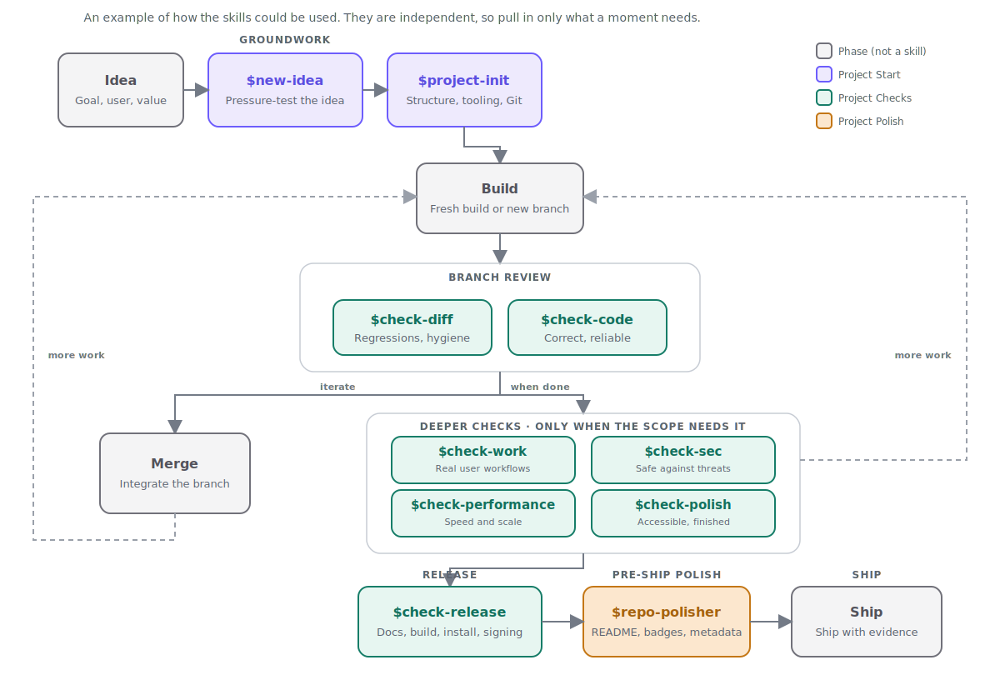

# GiftedLoser Skills

> From a rough idea to a release decision, with evidence at every step.


GiftedLoser Skills is a growing collection of personal, on-demand Codex workflows. The first pack helps turn an uncertain idea into a well-formed project. The second checks whether the resulting work is correct, real, safe, fast, polished, and ready to release.

These skills are intentionally composable. Install the complete collection or only the pack that solves your current problem.

## From idea to release



You do not need to run every check on every change. Choose the confidence checks that match the project's actual risks.

## Packs

| Pack | Skills | Purpose |
|---|---|---|
| [Project Start](packs/project-start/README.md) | `$new-idea`, `$project-init` | Challenge the idea, create an approved project handoff, and establish the repository safely |
| [Project Checks](packs/project-checks/README.md) | Seven `$check-*` skills | Audit the change, real behavior, implementation, security, performance, interface, and release |

### Complete bundle

`dist/GiftedLoser-Skills-Complete.zip` contains all nine skills. Use it when you want the full idea-to-release workflow.

The pack ZIPs remain available when you want only one part:

- `dist/GiftedLoser-Project-Start.zip`
- `dist/GiftedLoser-Project-Checks.zip`

## Skills at a glance

| You are thinking... | Use | What you get |
|---|---|---|
| “Is this idea actually worth building?” | `$new-idea` | A candid review of value, contradictions, gaps, scope, feasibility, risks, and experience direction, ending in `docs/PROJECT.md` |
| “Set this project up properly.” | `$project-init` | A clean foundation with verified commands, repository instructions, structure, Git hygiene, and safe defaults |
| “Review what I just changed.” | `$check-diff` | A focused review of change-caused defects, regressions, accidental files, and missing verification |
| “Does this actually work?” | `$check-work` | Real end-to-end product workflows executed from the user's perspective |
| “Is the implementation solid?” | `$check-code` | Correctness, reliability, data integrity, maintainability, and incomplete production behavior |
| “Could someone misuse or break this?” | `$check-sec` | Practical security defects, unsafe trust assumptions, and clearly separated hardening advice |
| “Why is this slow?” | `$check-performance` | Measured bottlenecks, expected benefits, and exact measurements to rerun after fixes |
| “Does the interface feel finished?” | `$check-polish` | Real UI testing for visual quality, interaction, responsiveness, accessibility, and platform behavior |
| “Can I confidently ship this?” | `$check-release` | A GO/NO-GO covering repository presentation, docs, versions, build, packaging, installation, upgrades, signing, and removal |

## The project handoff

`$new-idea` reads existing conversations, notes, mockups, and project files before asking questions. It challenges the proposal honestly and may conclude that the project is strong, needs decisions, or should not be built yet.

Its only project mutation is an approved `docs/PROJECT.md` with one status:

- `READY FOR PROJECT-INIT`
- `NEEDS DECISIONS`
- `DO NOT BUILD YET`

`$project-init` looks for that handoff automatically. When present, it respects the status and uses the document as approved product intent while verifying technical claims against the repository. When absent, initialization behaves normally; `$new-idea` is always optional.

## Installation

Download and extract the desired ZIP, then copy the contained skill folders into your personal Codex skills directory.

### Windows PowerShell

```powershell
New-Item -ItemType Directory -Force "$env:USERPROFILE\.codex\skills" | Out-Null
Copy-Item -Recurse -Force .\* "$env:USERPROFILE\.codex\skills\"
```

### macOS or Linux

```bash
mkdir -p ~/.codex/skills
cp -R ./* ~/.codex/skills/
```

Start a fresh Codex task after installation so the skill catalog reloads. Every skill is explicit-only; invoke one by name, such as:

```text
$new-idea
```

## Operating model

- `$new-idea` may create or update only `docs/PROJECT.md`.
- `$project-init` may establish or normalize the repository but never publishes without explicit authorization.
- Every `$check-*` skill is audit-only and never repairs, commits, pushes, publishes, or deploys.
- Findings distinguish confirmed defects, likely risks, and verification gaps.
- Missing execution evidence lowers confidence instead of being presented as success.

## Repository layout

```text
skills/
├── assets/
│   └── project-lifecycle.svg
├── packs/
│   ├── project-start/
│   │   ├── README.md
│   │   └── skills/
│   │       ├── new-idea/
│   │       └── project-init/
│   └── project-checks/
│       ├── README.md
│       └── skills/
│           └── check-*/
├── dist/
│   ├── GiftedLoser-Project-Start.zip
│   ├── GiftedLoser-Project-Checks.zip
│   └── GiftedLoser-Skills-Complete.zip
└── README.md
```

New packs can be added later without changing how existing skills are installed or invoked.

---

Built for people who would rather discover a bad assumption early than ship it confidently.
